# PawPal+ (Module 2 Project)

You are building **PawPal+**, a Streamlit app that helps a pet owner plan care tasks for their pet.

## Scenario

A busy pet owner needs help staying consistent with pet care. They want an assistant that can:

- Track pet care tasks (walks, feeding, meds, enrichment, grooming, etc.)
- Consider constraints (time available, priority, owner preferences)
- Produce a daily plan and explain why it chose that plan

Your job is to design the system first (UML), then implement the logic in Python, then connect it to the Streamlit UI.

## What you will build

Your final app should:

- Let a user enter basic owner + pet info
- Let a user add/edit tasks (duration + priority at minimum)
- Generate a daily schedule/plan based on constraints and priorities
- Display the plan clearly (and ideally explain the reasoning)
- Include tests for the most important scheduling behaviors

## Getting started

### Setup

```bash
python -m venv .venv
source .venv/bin/activate  # Windows: .venv\Scripts\activate
pip install -r requirements.txt
```

### Suggested workflow

1. Read the scenario carefully and identify requirements and edge cases.
2. Draft a UML diagram (classes, attributes, methods, relationships).
3. Convert UML into Python class stubs (no logic yet).
4. Implement scheduling logic in small increments.
5. Add tests to verify key behaviors.
6. Connect your logic to the Streamlit UI in `app.py`.
7. Refine UML so it matches what you actually built.

## 🗺️ System Design (UML)

Final class diagram (source: [`diagrams/uml_final.mmd`](diagrams/uml_final.mmd)). GitHub renders it automatically.

```mermaid
classDiagram
    direction LR

    class Priority {
        <<enumeration>>
        LOW = 1
        MEDIUM = 2
        HIGH = 3
    }

    class Frequency {
        <<enumeration>>
        ONCE
        DAILY
        WEEKLY
        +interval() timedelta
    }

    class Owner {
        <<dataclass>>
        +str name
        +int available_minutes
        +list~Pet~ pets
        +add_pet(pet: Pet) None
        +remove_pet(pet_name: str) bool
        +get_pet(pet_name: str) Pet
        +get_all_tasks() list~Task~
    }

    class Pet {
        <<dataclass>>
        +str name
        +str species
        +str breed
        +int age
        +list~Task~ tasks
        +add_task(task: Task) None
        +remove_task(task: Task) bool
        +get_tasks(include_completed: bool) list~Task~
    }

    class Task {
        <<dataclass>>
        +str description
        +time time
        +int duration_minutes
        +Priority priority
        +Frequency frequency
        +date due_date
        +bool completed
        +str pet_name
        +start() datetime
        +end() datetime
        +is_due_on(day: date) bool
        +overlaps(other: Task) bool
        +mark_complete(completed_on: date) Task
    }

    class Scheduler {
        +Owner owner
        +list~Task~ plan
        +list~tuple~ skipped
        +get_tasks_for_day(day: date) list~Task~
        +filter_tasks(pet_name: str, completed: bool) list~Task~
        +filter_by_pet(pet_name: str) list~Task~
        +filter_by_status(completed: bool) list~Task~
        +sort_by_time(tasks: list~Task~) list~Task~$
        +sort_by_priority(tasks: list~Task~) list~Task~$
        +find_conflicts(day: date) list~tuple~
        +detect_conflicts(day: date) list~str~
        +generate_plan(day: date) list~Task~
        +total_minutes() int
        +complete_task(task: Task, completed_on: date) Task
        +explain() str
    }

    Owner "1" o-- "0..*" Pet : owns
    Pet "1" *-- "0..*" Task : needs
    Task --> Priority : ranked by
    Task --> Frequency : repeats on
    Task ..> Task : mark_complete() creates next occurrence
    Scheduler "0..*" --> "1" Owner : manages
    Scheduler ..> Task : filters, sorts, plans
    Scheduler ..> Pet : complete_task() adds next occurrence

    note for Task "One Task = one occurrence on one due_date.\npet_name links back to its Pet by name."
    note for Scheduler "skipped holds (Task, reason) pairs.\nfind_conflicts returns (Task, Task) pairs.\nmark_complete / complete_task return None for one-time tasks."
```



## 🖥️ Sample Output

```
Today's Schedule - Tuesday, October 06, 2026
============================================
Plan for Jordan (85/90 min):
  08:00  Morning walk for Mochi (30 min) [high]
  08:00  Brush teeth for Mochi (5 min) [medium]
  08:10  Vet call for Luna (15 min) [high]
  08:45  Medication for Luna (5 min) [high]
  17:00  Litter box for Luna (10 min) [medium]
  17:00  Play session for Luna (20 min) [medium]
Skipped:
  Grooming for Mochi [low] - needs 45 min, only 5 min left

Warnings:
  Conflict (Mochi has two tasks at once): 'Morning walk' (08:00-08:30) overlaps 'Brush teeth' (08:00-08:05)
  Conflict (Mochi and Luna both need you): 'Morning walk' (08:00-08:30) overlaps 'Vet call' (08:10-08:25)
  Conflict (Luna has two tasks at once): 'Play session' (17:00-17:20) overlaps 'Litter box' (17:00-17:10)
```


## 🧪 Testing PawPal+

```bash
# Run the full test suite:
python -m pytest

# Show each test name as it runs:
python -m pytest -v
```

### What the tests cover

The 22 tests in `tests/test_pawpal.py` use a fixed date, so they give the same result whenever they run.

- **Sorting:** tasks come back in time order and the original list is unchanged. A task tomorrow morning sorts after one this evening, two tasks at the same time keep the order they were added, and priority ties go to the shorter task, then the earlier one.
- **Recurring tasks:** completing a daily task creates one for the next day, and a weekly task creates one a week later. One-time tasks don't repeat. A task finished late comes back counted from the day it was finished, a weekly task finished early keeps its original schedule, and completing the same task twice doesn't create a duplicate.
- **Conflict detection:** two tasks at the same time are flagged, and overlaps between two pets name both pets. One long task conflicts with every task inside it. Back-to-back tasks (one ends at 08:30, the next starts at 08:30) are not flagged, and completed tasks and tasks on other days are ignored.
- **Daily plan:** an owner with no tasks gets an empty plan and "No tasks scheduled." A task that exactly fills the time budget is kept. A task that doesn't fit is skipped with a reason, and smaller tasks after it can still be scheduled.
- **Filtering and basics:** filters by pet and by status work together, and pet names match regardless of capitalization. Adding a task adds it to the pet, and completing a task marks it done.

### Sample test output

```
============================= test session starts ==============================
platform darwin -- Python 3.12.7, pytest-7.4.4, pluggy-1.0.0
rootdir: /Users/vyeagra/COSC491/PawPal
configfile: pytest.ini
testpaths: tests
plugins: anyio-4.2.0
collected 22 items

tests/test_pawpal.py ......................                              [100%]

============================== 22 passed in 0.01s ==============================
```

### Confidence level: ⭐⭐⭐⭐☆ (4/5)

All 22 tests pass. They cover the main scheduling behaviors (sorting, recurring tasks, conflict detection and planning) and the edge cases most likely to break them, such as empty plans, tasks at the same time, back-to-back tasks and a task that exactly fills the time budget. It's not 5 stars because of a few known gaps that aren't tested yet:

- Conflicts are only checked within one day, so a task that runs past midnight isn't checked against the next morning's tasks.
- Completing a repeating task whose pet has been removed creates the next task but doesn't attach it to any pet.
- If a pet has two identical tasks, `remove_task` removes the first match, which may not be the one you meant.
- The Streamlit UI is only tested by hand.

## 📐 Smarter Scheduling

All scheduling logic lives in `pawpal_system.py`. Run `python main.py` to see each feature in the terminal.

| Feature | Method(s) | What it does |
|---------|-----------|--------------|
| Sorting by time | `Scheduler.sort_by_time()` | Orders tasks by date and start time |
| Sorting by priority | `Scheduler.sort_by_priority()` | High → medium → low; ties go to the shorter task, then the earlier one |
| Filtering | `Scheduler.filter_tasks()`, `filter_by_pet()`, `filter_by_status()` | Shows tasks for one pet, by completion status, or both |
| Daily plan | `Scheduler.generate_plan()`, `explain()` | Keeps the most important tasks that fit the owner's time and explains what was skipped |
| Conflict detection | `Scheduler.detect_conflicts()`, `Task.overlaps()` | Warns when tasks start together or overlap, for the same pet or different pets |
| Recurring tasks | `Task.mark_complete()`, `Scheduler.complete_task()`, `Frequency.interval()` | Completing a daily or weekly task creates its next occurrence |

### Sorting
`sort_by_time()` uses `sorted()` with a lambda key, `key=lambda t: t.start()`. `start()` combines the task's date and time, so tomorrow's 07:30 sorts after today's 18:30. `sort_by_priority()` sorts on the tuple `(-priority, duration, start)`. Python compares tuples left to right, so priority decides first and the other fields only break ties.

### Filtering
`filter_tasks(pet_name=None, completed=None)` combines filters. Any filter left as `None` is ignored, so `filter_tasks(pet_name="Luna", completed=False)` returns Luna's unfinished tasks. Pet names match regardless of capitalization. `filter_by_pet()` and `filter_by_status()` are shortcuts that call it.

### Conflict detection
`detect_conflicts()` sorts today's tasks by start time and checks each pair for a shared start time or an overlapping time window. It is lightweight: it returns a list of warning messages and never raises an error, so the app keeps running and the plan is still usable. Each warning says whether one pet has two tasks at once or two pets need the owner at the same time. Because the list is sorted, it stops checking a task once later tasks start after it ends.

### Recurring tasks
Each task has a `Frequency` (`ONCE`, `DAILY` or `WEEKLY`). When `complete_task()` marks a repeating task done, `mark_complete()` creates a copy due one day or one week later and adds it to the same pet. The next date counts from whichever is later, the due date or the day it was completed, so a task finished late doesn't come back already overdue. Completing the same task twice doesn't create a duplicate.

### Tradeoffs
- **Conflicts are warned about, not fixed.** Both overlapping tasks stay in the plan. The owner decides which conflicts matter.
- **Greedy planning.** The highest-priority tasks are kept first, even if a different mix would use more of the available time.

## 📸 Demo Walkthrough

Describe your app in numbered steps so a reader can follow along without watching a video:

1. **Start the app.** Run `streamlit run app.py`. The page opens with a short welcome and a collapsible "How it works" guide.
2. **Set up the owner.** In the **Owner** section, enter your name and how many minutes you have for pet care today (for example, `60`). This is the time budget the scheduler plans around.
3. **Add pets.** In **Add a Pet**, type a name (for example, `Mochi`), pick a species and click **Add pet**. Add a second pet such as `Luna` the cat. The app won't add the same name twice, and the pets appear in a list below the form.
4. **Schedule tasks.** In **Schedule a Task**, choose a pet and enter a task name, start time, duration, how often it repeats (once, daily or weekly) and a priority. Click **Add task**. For example, add a 30-minute high-priority daily `Morning walk` for Mochi at 08:00 and a 15-minute medium-priority `Breakfast` for Luna at 08:15.
5. **Review the task table.** Every task appears in a **Current tasks** table, sorted by time, with its pet, duration, priority, how often it repeats and whether it's done.
6. **Generate the schedule.** In **Build Schedule**, click **Generate schedule**. PawPal+ keeps the highest-priority tasks that fit your time and lists them in time order. A summary shows how many minutes are used. With the example tasks, this is "Planned 2 task(s): 45 of 60 minutes."
7. **Read warnings and explanations.** If tasks overlap, a yellow warning names the tasks and says whether one pet has two tasks at once or two pets need you at the same time. With the example tasks, Mochi's walk (08:00-08:30) overlaps Luna's breakfast (08:15-08:30), so the warning says "Mochi and Luna both need you." Below that, a text summary lists each planned task and gives a reason for any task that didn't fit (for example, "needs 20 min, only 10 min left").
8. **Complete a task.** Pick a task from **Mark a task complete** and click **Complete**. The table shows it as done. If the task repeats, a message gives the date of the next one (for example, "Done! Next 'Morning walk' is due Wed 10/07."), and the new task is added to the table. One-time tasks show "won't repeat." Generate the schedule again and the completed task is no longer in today's plan.

**Screenshot or video** *(optional)*: <!-- Insert a screenshot or link to a demo video here -->
